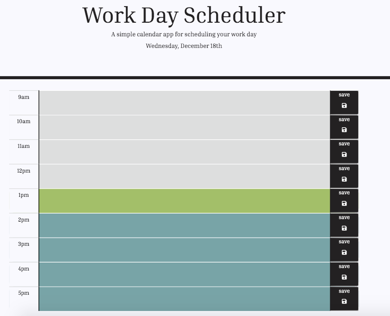

# Work Day Scheduler

 

* A simple calendar application that allows a user to save events for each hour of the day.

## Description
* This app runs in the browser and features dynamically updated HTML and CSS powered by jQuery.
* The app displays standard business hours (9 a.m. to 5 p.m.) with each time slot representing one hour.
* Clicking on the save button stores the time and user input in localStorage.

## Domains
* This website is currently being hosted on Github Pages at [https://brittanieboyko.github.io/day-planner/]

## Built with:
* Good old CSS, HTML, Javascript, and JQuery!
* Bootstrap v 4.3.1 (https://getbootstrap.com/)
* [GitHub Pages](http://pages.github.com/)

## Contact
#### Developer
* e-mail: brittanie.boyko@gmail.com
